# All SmartBrain Repos
- **SmartBrain v1: [Client](https://github.com/rbhachu/smartbrain-frontend/) / [Server](https://github.com/rbhachu/smartbrain-backend/)** 
- **SmartBrain v2: [Client](https://github.com/rbhachu/smartbrain-frontend-jwt/) / [Server](https://github.com/rbhachu/smartbrain-backend-jwt/)** 
- **SmartBrain Docker v1: [Docker Server](https://github.com/rbhachu/smartbrain-backend-docker)** 
- **SmartBrain Docker v2: [Docker Client + Server](https://github.com/rbhachu/smartbrain-master-docker/)** 

----

[](https://github.com/rbhachu/smartbrain-frontend-jwt) [](https://github.com/rbhachu/smartbrain-frontend-jwt)

__*Updated Version of this Repo: https://github.com/rbhachu/smartbrain-master-docker*__
<br><br>

<h1 align="center">SmartBrain Master (Front-End Client)</h1>
<div align="center">

:rocket: **[View Live Demo](https://rbhachu-smartbrain-f-master.herokuapp.com/)** :rocket:<br>

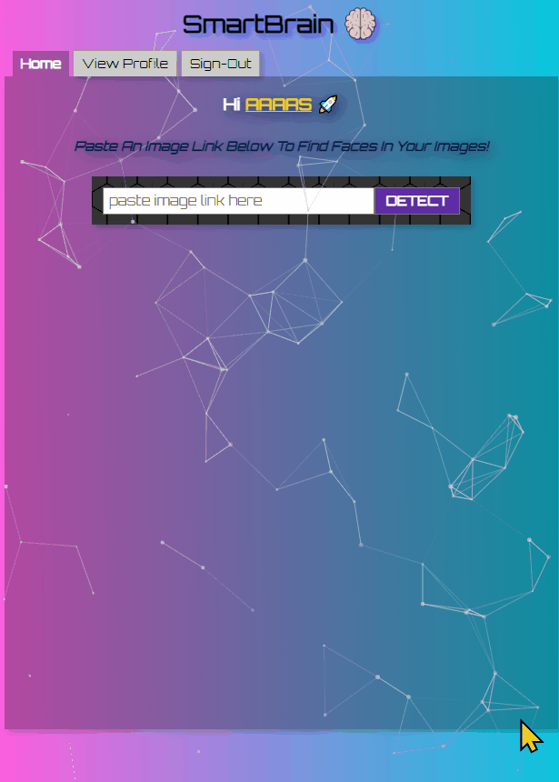
</div>
<br>


## How to use the App
<p>
You can use the following test login details <i>(ensure lowercase as case sensitive)</i>

<br>
<b>Email:</b> a@a.com
<br>
<b>Password:</b> a

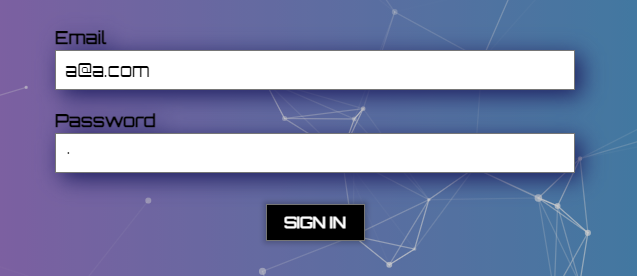<br>
_**Please note: Site may take a few seconds to initially load due to using free tier on Heroku .**_
<br>

Or click on the 'Register' tab and create your own new login details to use instead.


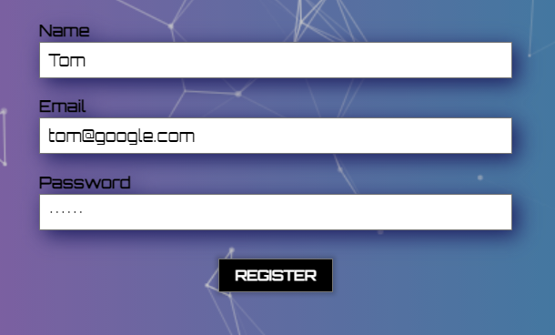
<br>

Once logged in simply copy, then paste an image url from the web <i>(example: https://rbhachu-smartbrain-f-master.herokuapp.com/test-image.jpg)</i> into the search input field, then click the 'DETECT' button to run the Face Detection API.

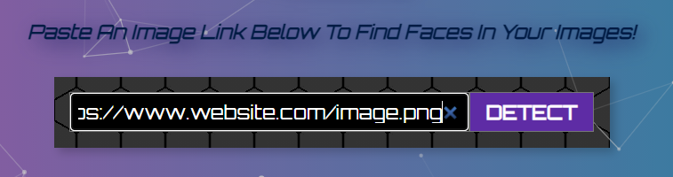
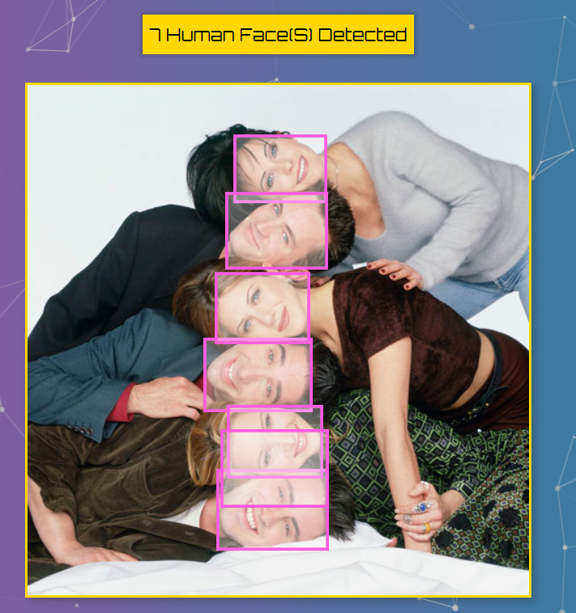
<br>

Each time you upload an image the 'Total Images Submitted' value is incremented by +1.<br>
You can view the current total in the 'View Profile' tab, along with the 'Current Rank 'Badge', which is fed from AWS Lambda as a serverless function.

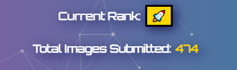

The Rank Badge updates based on the current image upload count.
<br>
Total Images Submitted | Current Rank 'Badge'
------------ | -------------
0 | 😐
1 | 😃
2 | 😀
3 | 😊
4 | 😉
5 | 😍
6 | 🔶
7 | 🔷
8 or over | 🚀
<p/><br>


## Description
<p>
A React App that detects, then highlights faces in web images. Including a user profile with image upload count and a Ranking Badge served from <b>AWS Lambda</b> as a serverless function. 
<br><br>
Built with <b>React.js</b>, <b>Node.js</b>, <b>Express</b>, <b>Bcrypt</b>, <b>PostgreSQL</b>, <b>Redis</b>, <b>Tachyon CSS</b>, <b>Clarifai Face Detection API</b>, and all running on <b>Heroku Servers</b> 'synched' with <b>GitHub</b>. 
<br><br>
<b>Back-end Server Repo Link:</b> https://github.com/rbhachu/smartbrain-backend-jwt
<br><br>

<i>Thanks to Andrei Neagoie for creating the [ZTM Web Developer Zero to Mastery](https://www.udemy.com/the-complete-web-developer-zero-to-mastery) and [ZTM Junior to Senior Web Developer](https://www.udemy.com/course/the-complete-junior-to-senior-web-developer-roadmap/) courses which SmartBrain is based on.
<br><br>
Since completing both courses and further personal development I have also updated the SmartBrain app further extensively, adding numerous updates, bug fixes etc. With the fundamental update being to adapt it to run 100% remotely with Heroku hosting the site in tandem with PostgreSQL DB, Redis DB and AWS Lambda servers too.</i>
</p><br>


## Features
<ul>
<li>Multi-Face Detection using Clarifai Face Detection API</li>

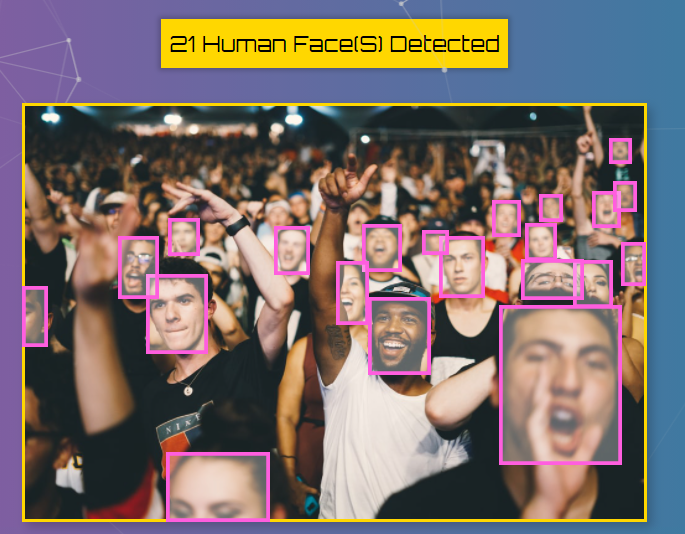
<br>

<li>Ranking badge element served from external AWS Lambda as a serverless function</li>


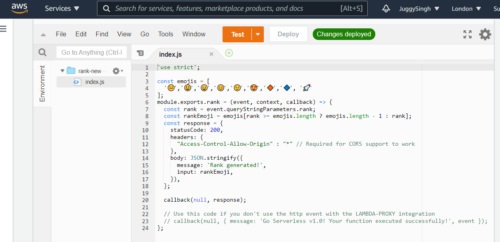
<br>

<li>User authentication using JSON Web Tokens (JWT)</li>

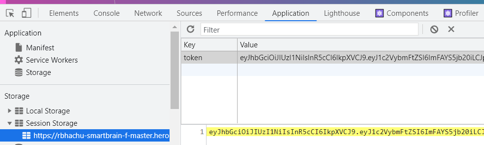
<br>

<li>With a Redis Database for Token Management</li>

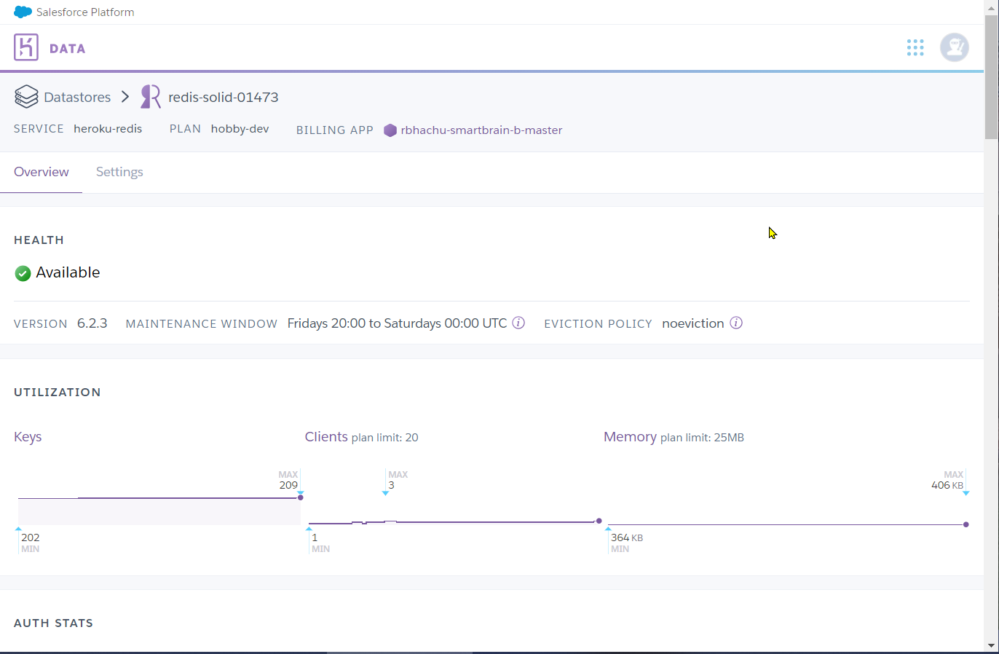
<br>

<li>User profile with capture of image uploads, stored via a PostgreSQL Database</li>

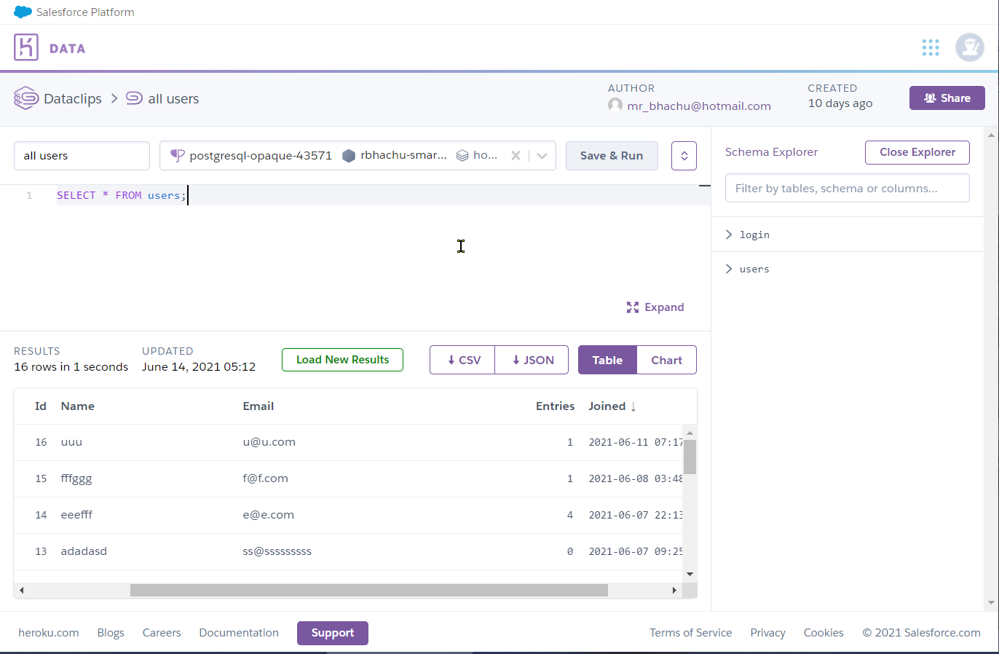
<br>

<li>Portable Web App (PWA) enabled</li>


<br>

<li>Responsive layout using Flexbox</li>

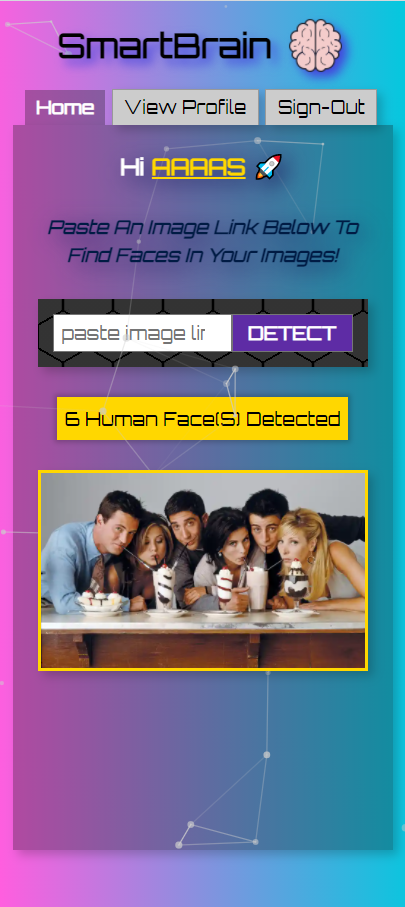
<br>

<li>TS Particles for background animation</li>


<br>

<li>Parallax tilt for interactive site logo</li>


<br>

<li>Form validation</li>

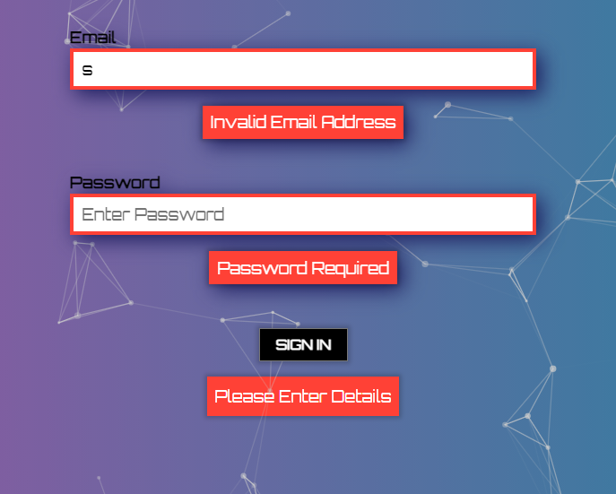
<br>

<li>Bcrypt user password encryption/decryption to/from PostgreSQL Database</li>

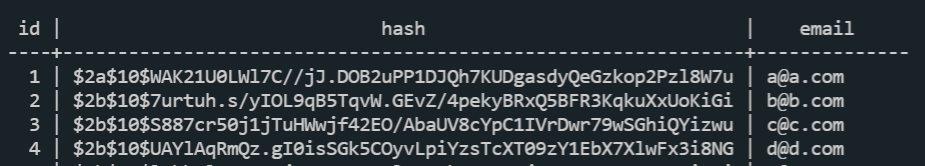
<br>

<li>Tabbed layout</li>

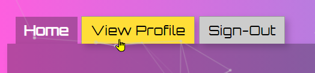
<br>

<li>Editable user profile</li>

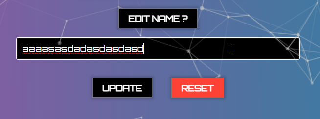
<br>

<li>Custom site fav icon with support for apple, android devices too</li>

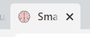
<br>

<li>The Heroku Server is also synched with the associated GitHub repo, so changes are automatically deployed</li>

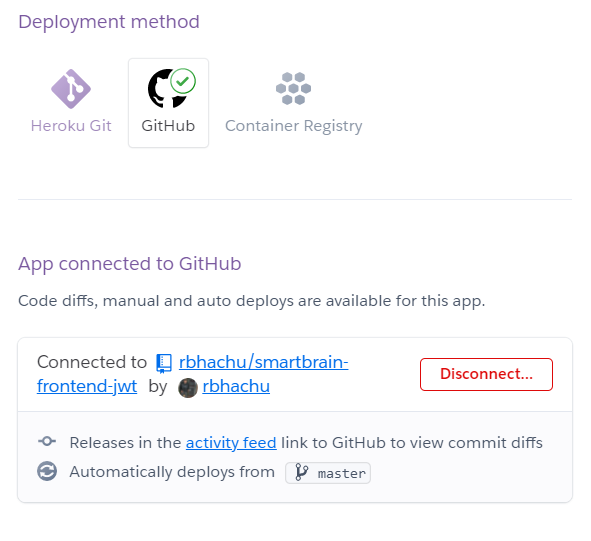
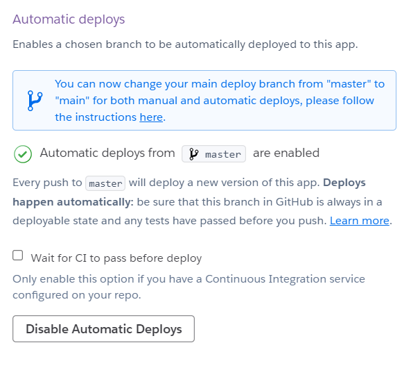
</p>


## Dependencies/NPM Modules
[React v17.0.2](https://www.npmjs.com/package/react) - Part of React core<br>
[React-dom v17.0.2](https://www.npmjs.com/package/react-dom) - Part of React core<br>
[React-scripts v4.0.3](https://www.npmjs.com/package/react-scripts) - Part of React core<br>
[Tachyons v4.12.0](https://www.npmjs.com/package/tachyons) - For dynamic css<br>
[Prop-Types v15.7.2](https://www.npmjs.com/package/prop-types) - for tab interface<br>
[React-Parallax-Tilt v1.5.23](https://www.npmjs.com/package/react-parallax-tilt) - For background animation<br>
[React-TSParticles v1.28.0](https://www.npmjs.com/package/react-tsparticles) - For interactive logo heading<br>
<br>


## Installation
<p>Open your Code Editor and 'CD' into your working directory, then download the repo to that location, by executing the following command in your terminal.<p>

```sh
git clone https://github.com/rbhachu/smartbrain-frontend-jwt.git
```

<p>Once the repo has been downloaded, 'CD' to the newly downloaded project folder. Then execute the following command in your terminal.<p>

```sh
npm install
```

<p>Also check for any updates by running the following command too.<p>

```sh
npm update
```
<br>


## Configuration
<p>There is a settings file in the root of the project folder called '.env' which is also known as the Environmental Variables file.
<br><br>
Using this file you can control how you want the app to run; Remotely or Locally.
<br><br>
To run the app Remotely, overwrite the current values in the .env file with the following values;
<br>

```env
#FRONT-END CLIENT
REACT_APP_CLIENT_URL=https://rbhachu-smartbrain-f-master.herokuapp.com

#BACK-END SERVER
REACT_APP_SERVER_URL=https://rbhachu-smartbrain-b-master.herokuapp.com

#AWS Lambda
REACT_APP_AWS_LAMBDA=https://vqvvli950h.execute-api.us-east-1.amazonaws.com
```

Alternatively, to run the app Locally, overwrite the current values in the .env file with the following values; *
<br>

```env
#FRONT-END CLIENT
REACT_APP_SERVER_URL=http://localhost:3001

#BACK-END SERVER
REACT_APP_CLIENT_URL=http://localhost:3000

#AWS Lambda
REACT_APP_AWS_LAMBDA=https://vqvvli950h.execute-api.us-east-1.amazonaws.com
```

<i>* To deploy SmartBrain locally, you will also need to download the SmartBrain Back-End Server Repo and install it too. Full instructions on how to do this are included in the repo readme file.<br>
Back-End Server Repo Link: https://github.com/rbhachu/smartbrain-backend-jwt</i>
</p><br>


## Deployment
<p>Finally, to run the app, simply execute the following command in your terminal (ensuring you are in the correct project directory too).</p>

```sh
npm start
```

<p>After a few seconds, your browser should automatically open to the following link; http://localhost:3000 and display the project in the browser.</p>

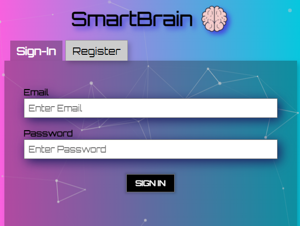
<br>


## Issues
Please drop me a message if you have any issues or problems running the project.
<br><br>


## Author
👤 **Rishi Singh Bhachu**<br>
Contact me via [LinkedIn](https://www.linkedin.com/in/rishisinghbhachu/)
<br><br>


## Show your support
If you liked this project it would be greatly appreciated to show your support by simply giving this repo a ⭐️ rating too, many thanks!